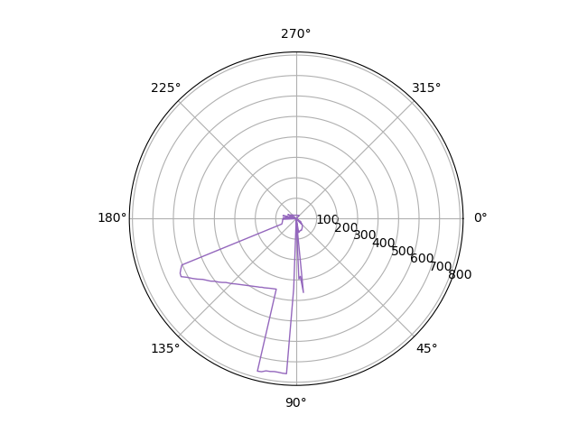
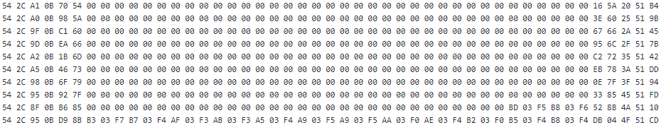
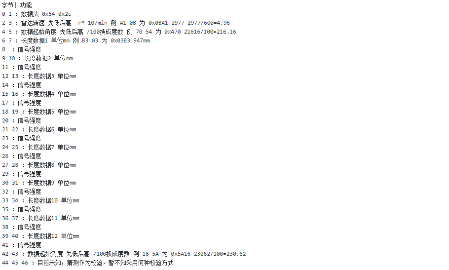

# Laser_radar_tool
激光雷达测试程序

## 效果图

## 环境
Python3.7

使用库

serial

numpy

math

matplotlib

pip 安装命令

		pip install serial numpy math matplotlib

## 接线方式
5V
GND
PWM
RXT

测试时将PWM经4.7k电阻上拉到VCC
串口波特率采用115200

## 部分数据

## 数据说明
一帧数据长度47个字节
其中数据部分36个字节
在数据部分中每一次测量点占三个字节，前两个字节为长度数据，后一个字节为信号质量数据
一组数据包含12个点

## 详细说明

### 其中数据格式为

